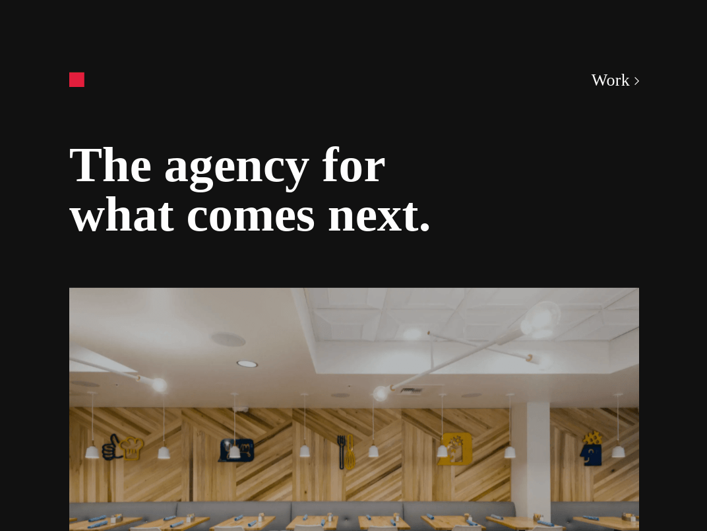

<h1 align="center">Red Square</h1>

   Solution for a challenge from  <a href="https://frontendpractice.com" target="_blank">Frontendpractice.com</a>.

  <h3>
    <a href="https://jdegand.github.io/red-square/">
      Github Pages
    </a>
     | 
    <a href="https://www.frontendpractice.com/project/red-square">
      Frontend Practice    
    </a>
  </h3>

## Table of Contents

- [Overview](#overview)
  - [Built With](#built-with)
- [Features](#features)
- [Useful Resources](#useful-resources)

## Overview

### Built With

- Grid 
- Flex
- Vanilla JS

## Features

The [challenge](https://www.frontendpractice.com/project/red-square) was to build an application to complete the following user stories:

- [x] User story: Recreate the layout
- [x] User story: Animate the sections and text fading in on scroll.
- [x] User story: Create the blur & hover effect that appears when hovering the "Let's talk" sentence at the bottom of the page.

## Useful Resources

- [Dev.to](https://dev.to/jslim/fading-up-sections-using-intersection-observer-3fhj)
- [WOW Animation](https://wowjs.uk/)
- [Blog](https://coder-coder.com/background-image-opacity/) - Background Opacity & Text
- [Geeks for Geeks](https://www.geeksforgeeks.org/how-to-write-hover-condition-for-abefore-and-aafter-in-css/) - Before/After & Hover
- [Stack Overflow](https://stackoverflow.com/questions/54917586/blur-entire-background-on-hover/54917700) - Blur & Hover
- [Blog](https://blog.prototypr.io/how-to-make-a-background-blur-in-css-with-one-line-of-code-e446c7236e60) - Blur background
- [Stack Overflow](https://stackoverflow.com/questions/20377990/why-doesnt-blur0-remove-all-text-blur-in-webkit-chrome-on-retina-screens) - Blur issues
- [MDN Docs](https://developer.mozilla.org/en-US/docs/Web/CSS/backdrop-filter) - Backdrop Filter